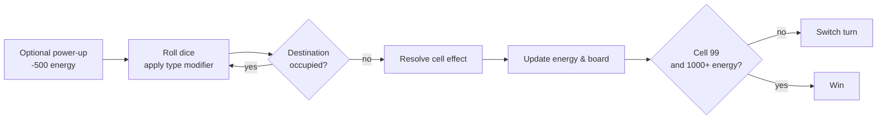

# DooR DasH: Scare vs Laugh Touchdown

> A turn-based, two-player strategy board game set in the world of Monstropolis, built in Java with a fully animated JavaFX interface.


## Game Walkthrough
<p align="center">
  <video src="
https://github.com/user-attachments/assets/caa7685f-2a18-49a9-b57d-b34d0a68bfc9
" controls width="720"></video>
</p>


## Screenshots

<table align="center">
  <tr>
    <td align="center"><br><sub>Main menu</sub></td>
    <td align="center">
<br><sub>Board & gameplay</sub></td>
  </tr>
  <tr>
    <td align="center"><br><sub>Card draw</sub></td>
    <td align="center"><br><sub>Loading Screen</sub></td>
  </tr>
</table>

---

## Overview

**DooR DasH** is a competitive board game where two monsters race across a 100-cell board to collect energy and reach Boo's Door first. It reimagines the classic *Snakes & Ladders* formula as an energy-economy strategy game: every cell is a decision, every card can swing the match, and the rivalry between **Scarers** (who harvest screams) and **Laughers** (who harvest laughter) drives the whole design.

A player wins only by satisfying **both** conditions at once — landing exactly on the final cell **and** holding at least **1000 energy** — which turns the back half of every match into a tense balance of position versus power.

The project is split cleanly into a self-contained **game engine** (pure logic, no UI dependencies) and a **JavaFX presentation layer**, with all game content driven by external CSV files rather than hard-coded values.

## Features

- **Decoupled engine / GUI architecture** — the rules engine has zero dependency on JavaFX and is exercised independently by the test suite, so game logic can be reasoned about and verified in isolation from rendering.
- **Data-driven content** — monsters, cells, and cards are defined in `cards.csv`, `cells.csv`, and `monsters.csv` and parsed at runtime by a dedicated `DataLoader`. Tuning the game or adding content requires no code changes.
- **Polymorphic type & card systems** — four monster archetypes (Dasher, Dynamo, Multitasker, Schemer) and five card families (Swapper, Energy Steal, Start Over, Shield, Confusion) are modeled through inheritance hierarchies and a shared `CanisterModifier` interface, so each behaves differently through the same call sites.
- **Rich rules interactions** — team-wide door energy, one-time door activation, shields, role-confusion timers, conveyor belts, contamination penalties, and a 25-card reshuffling draw pile all interact through a single turn pipeline.
- **Animated JavaFX front end** — custom board rendering, music, sound effects, and victory video cutscenes loaded as classpath resources.
- **165 automated tests** — a JUnit 4 suite (121 public + 44 private cases) covering engine behaviour.

## Gameplay at a Glance

| Element | Role in the game |
| --- | --- |
| **Doors (50)** | Alternate between Scarer and Laugher. Landing on a matching door grants energy to your whole team; a mismatch drains it. Each door fires only once. |
| **Monster Cells (6)** | Host the monsters not chosen as player or opponent. A role match triggers a free power-up; a mismatch can swap energy totals. |
| **Conveyor Belts (5)** | Launch you forward across the board. |
| **Contamination Socks (5)** | Send you backward and drain 100 energy (CDA protocol). |
| **Card Cells (10)** | Draw from a shuffled 25-card pile — steal energy, raise shields, swap places, or scramble both players' roles. |
| **Monster Types** | Dasher (speed), Dynamo (doubled energy swings), Multitasker (+200 energy, half movement), Schemer (steals from everyone). |

Each monster also has a paid power-up (500 energy) usable on its turn, or triggered for free on a matching Monster Cell.

## Architecture

The codebase separates **what the game does** from **how it looks**:

```
DoorDash/
├── cards.csv · cells.csv · monsters.csv   # external game data
└── src/
    ├── assets/                            # images, audio, video (classpath resources)
    └── game/
        ├── engine/                        # pure game logic — no UI imports
        │   ├── Game.java                  # turn pipeline & win conditions
        │   ├── Board.java                 # 100-cell board, wrap-around movement
        │   ├── Role.java · Constants.java
        │   ├── monsters/                  # Monster + Dasher/Dynamo/Multitasker/Schemer
        │   ├── cells/                     # Cell + Door/Monster/Transport/Card cells
        │   ├── cards/                     # Card + 5 card families
        │   ├── dataloader/                # CSV parsing into game objects
        │   ├── interfaces/                # CanisterModifier
        │   └── exceptions/                # domain-specific checked exceptions
        ├── gui/
        │   └── MainApp.java               # JavaFX application & rendering
        └── tests/                         # 165 JUnit 4 test cases
```

A single turn flows through the engine like this:



## Tech Stack

- **Language:** Java 8
- **UI:** JavaFX (Controls, Graphics, Media)
- **Testing:** JUnit 4
- **Data:** CSV-driven configuration
- **Tooling:** Eclipse project (`.project` / `.classpath` included)

## Getting Started

> Game data (the CSV files) is read relative to the working directory, and assets are loaded from the classpath — so run the game from the **`DoorDash/`** folder.

### Option A — Eclipse (recommended, matches the bundled project)

1. **File → Import → Existing Projects into Workspace** and select the `DoorDash` folder.
2. Ensure the project runs on a **Java 8 (JavaSE-1.8)** JRE, which bundles JavaFX.
3. Right-click `src/game/gui/MainApp.java` → **Run As → Java Application**.

### Option B — Command line, JDK 8 (JavaFX bundled)

```bash
cd DoorDash
# compile everything except the test sources
javac -d out $(find src -name "*.java" -not -path "*/tests/*")
# run: 'out' holds the classes, 'src' provides the /assets resources
java -cp "out:src" game.gui.MainApp        # Windows: use "out;src"
```

### Option C — Command line, JDK 11+ (JavaFX is separate)

Download the [JavaFX SDK](https://openjfx.io/) and point `--module-path` at its `lib` folder:

```bash
cd DoorDash
export PATH_TO_FX=/path/to/javafx-sdk/lib
javac --module-path $PATH_TO_FX --add-modules javafx.controls,javafx.media \
      -d out $(find src -name "*.java" -not -path "*/tests/*")
java  --module-path $PATH_TO_FX --add-modules javafx.controls,javafx.media \
      -cp "out:src" game.gui.MainApp
```

## Running the Tests

The engine ships with **165 JUnit 4 tests** in `src/game/tests/`. In Eclipse, right-click `Milestone2PublicTests.java` (or `Milestone2PrivateTests.java`) → **Run As → JUnit Test**. The tests target the engine only and need no JavaFX runtime.

## Roadmap

Ideas for future iterations:

- Migrate to a Maven/Gradle build for one-command setup and dependency management.
- Add an AI opponent with selectable difficulty.
- Support local hot-seat configuration of role and monster selection from the UI.
- Add a replay log and end-of-game statistics screen.

## Engineering Highlights

A few things I'm proud of in this project:

- **I kept the rules engine completely free of UI concerns.** Because `Game`, `Board`, and the monster/card/cell hierarchies know nothing about JavaFX, I could grow a 165-case test suite against the real game logic and iterate on the interface without fear of breaking the rules.
- **I pushed all game content into data.** Balancing the game — door energies, card rarities, starting stats — is a matter of editing CSV rows, which made tuning fast and kept magic numbers out of the code.
- **I modeled genuinely different behaviours through one set of abstractions.** Four monster types and five card families produce very different outcomes while flowing through the same turn pipeline, which was a good exercise in using polymorphism to tame branching complexity.

## License

Released under the [MIT License](LICENSE).

## Disclaimer

This is a **non-commercial, educational fan project** created for learning purposes. *Monsters, Inc.*, its characters, and related names are the property of **Pixar / The Walt Disney Company**. This project is not affiliated with, endorsed by, or sponsored by them, and no copyrighted assets are distributed for commercial use.
